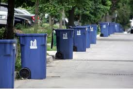

# Green-X-Recycling


The app was created to help workers find the location of jobs much quicker an the boss to see how big his area of service is so that he knows which worker to send where

The app uses geo-location to find out where workers is, the location of a job and the distance workers needs to travel making it easer for workers to calculate how long it will take to finish the job.

## Personas
* [Biza](/Persona_Biza.md): Owner of Green X Recycling
* [Lolo](/Persona_Lolo.md): Worker at Green X Recycling
* [Phindile](/Persona_Phindile.md): Community member

## Instructions
* Clone this repo to your local machine
* Open the terminal/cmd and change to the folder you cloned
* Run ```npm install```
* After this is successful setup a database using the database script
* Now run ```nodemon app.js``` and it should say ```Example app listening at http://localhost:8000```
