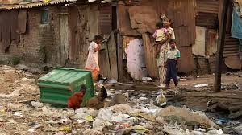

# Green-X-Recycling

<<<<<<< HEAD
App that allows the users to select the problem that they have in their communities in terms of rubbish/dirt.

Helps different communities to protect enviroment<br> that they live in including their health.

* [Biza](/Persona Biza.md):Owner Biza of the comp

* [Lolo](/Persona_Lolo.md): Works for Biza

We will our app will node.js,
Biza and Lolo want a solution that helps to improve the envoriment in communities, so that they can recycle the dirt by collecting it .

Now we need to create a Story Map to clarify what we as coders need to do, so that we can see what to create as a solution.
=======

The app was created to help workers find the location of jobs much quicker an the boss to see how big his area of service is so that he knows which worker to send where

The app uses geo-location to find out where workers is, the location of a job and the distance workers needs to travel making it easer for workers to calculate how long it will take to finish the job.

## Personas
* [Biza](/Persona Biza.md): Owner of Green X Recycling
* [Lolo](/Persona_Lolo.md): Worker at Green X Recycling

## Instructions
* Clone this repo to your local machine
* Open the terminal/cmd and change to the folder you cloned
* Run ```npm install```
* After this is successful setup a database using the database script
* Now run ```nodemon app.js``` and it should say ```Example app listening at http://localhost:8000```
>>>>>>> a17029362bc5846c95f74976aa75b0d3304aa8ac
